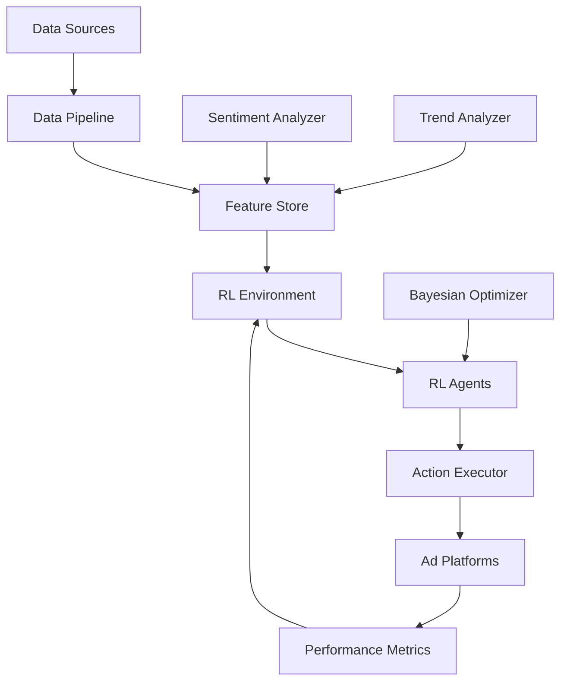

# AdBot - AI-Powered Advertising Optimization Platform

[](https://www.python.org/downloads/)
[](https://opensource.org/licenses/MIT)
[](https://github.com/psf/black)

AdBot is a cutting-edge advertising optimization platform that leverages reinforcement learning to maximize ROI across multiple advertising channels. Built with Stable Baselines 3 (SB3) and D3RLpy, it provides intelligent, real-time campaign optimization with Bayesian uncertainty quantification.

## 🚀 Key Features

- **Multi-Platform Integration**: Unified API for Google Ads, Facebook, TikTok, LinkedIn, Twitter, Instagram, and email marketing
- **Reinforcement Learning**: State-of-the-art RL algorithms for continuous optimization
- **Real-Time Analytics**: Google Trends integration and sentiment analysis
- **Smart Budget Allocation**: Dynamic budget optimization across campaigns and platforms
- **Bayesian Optimization**: Uncertainty-aware decision making and hyperparameter tuning
- **A/B Testing Framework**: Automated experimentation with statistical significance testing
- **Scalable Architecture**: Microservices-based design with Kubernetes orchestration

## 📊 Architecture Overview



## 🛠️ Technology Stack

### Core ML/RL
- **Stable Baselines 3**: PPO, SAC, TD3 for online learning
- **D3RLpy**: Offline reinforcement learning from historical data
- **Gymnasium**: RL environment framework
- **PyTorch**: Deep learning backend

### Data & Analytics
- **PostgreSQL + TimescaleDB**: Time-series data storage
- **Apache Kafka**: Real-time data streaming
- **Feast**: Feature store for ML features
- **Transformers**: BERT/RoBERTa for sentiment analysis

### Platform Integrations
- Google Ads API
- Facebook Business SDK
- TikTok Business API
- LinkedIn Marketing API
- Twitter Ads API
- Instagram Graph API

### Infrastructure
- **FastAPI**: High-performance API framework
- **Docker & Kubernetes**: Container orchestration
- **MLflow**: Model versioning and deployment
- **Prometheus & Grafana**: Monitoring and alerting

## 📦 Installation

### Prerequisites
- Python 3.11+
- Docker & Docker Compose
- PostgreSQL 14+
- Redis 6+

### Quick Start

1. Clone the repository:
```bash
git clone https://github.com/adlab/adbot.git
cd adbot
```

2. Create virtual environment:
```bash
python -m venv venv
source venv/bin/activate  # On Windows: venv\Scripts\activate
```

3. Install dependencies:
```bash
pip install -r requirements.txt
pip install -e .
```

4. Set up environment variables:
```bash
cp .env.example .env
# Edit .env with your API credentials
```

5. Initialize the database:
```bash
python scripts/init_db.py
```

6. Start the development server:
```bash
uvicorn src.api.main:app --reload
```

### Docker Setup

```bash
docker-compose up -d
```

## 🎯 Usage

### Basic Example

```python
from adbot import AdBot
from adbot.environments import MultiPlatformEnv
from adbot.agents import PPOAgent

# Initialize AdBot
bot = AdBot(config_path="configs/production.yaml")

# Create RL environment
env = MultiPlatformEnv(
    platforms=["google_ads", "facebook", "tiktok"],
    objective="maximize_roi"
)

# Train agent
agent = PPOAgent(env)
agent.train(total_timesteps=100000)

# Deploy trained agent
bot.deploy_agent(agent)
bot.start_optimization()
```

### Campaign Optimization

```python
from adbot.optimizers import BayesianCampaignOptimizer

optimizer = BayesianCampaignOptimizer()
optimal_params = optimizer.optimize(
    campaign_id="camp_123",
    metric="conversion_rate",
    budget=10000,
    duration_days=30
)
```

## 📁 Project Structure

```
adbot/
├── src/
│   ├── core/               # Core RL components
│   │   ├── agents/         # RL agents (PPO, SAC, etc.)
│   │   ├── environments/   # Gymnasium environments
│   │   ├── rewards/        # Reward function definitions
│   │   └── policies/       # Neural network policies
│   ├── integrations/       # Platform-specific integrations
│   │   ├── google_ads/
│   │   ├── facebook/
│   │   ├── tiktok/
│   │   └── ...
│   ├── analytics/          # Data analysis modules
│   │   ├── sentiment/      # Sentiment analysis
│   │   ├── trends/         # Google Trends integration
│   │   └── ranking/        # Ad ranking algorithms
│   ├── optimization/       # Optimization algorithms
│   │   ├── bayesian/       # Bayesian optimization
│   │   ├── budget/         # Budget allocation
│   │   └── bidding/        # Bid optimization
│   ├── api/                # FastAPI application
│   ├── models/             # Data models and schemas
│   └── utils/              # Utility functions
├── tests/                  # Test suite
├── configs/                # Configuration files
├── scripts/                # Utility scripts
├── notebooks/              # Jupyter notebooks
├── data/                   # Local data storage
├── docs/                   # Documentation
├── docker/                 # Docker configurations
└── k8s/                    # Kubernetes manifests
```

## 🔧 Configuration

AdBot uses YAML configuration files for different environments:

```yaml
# configs/production.yaml
app:
  name: "AdBot"
  version: "1.0.0"
  
database:
  host: "localhost"
  port: 5432
  name: "adbot_prod"
  
reinforcement_learning:
  algorithm: "PPO"
  learning_rate: 0.0003
  batch_size: 64
  n_epochs: 10
  
platforms:
  google_ads:
    enabled: true
    api_version: "v15"
  facebook:
    enabled: true
    api_version: "v18.0"
```

## 🧪 Testing

Run the test suite:

```bash
# Unit tests
pytest tests/unit

# Integration tests
pytest tests/integration

# Full test suite with coverage
pytest --cov=src tests/
```

## 📈 Performance Monitoring

AdBot includes comprehensive monitoring:

- **Real-time dashboards**: Grafana dashboards for campaign performance
- **ML metrics**: MLflow tracking for model performance
- **System metrics**: Prometheus monitoring for infrastructure
- **Alerts**: Configurable alerts for anomaly detection

Access the monitoring dashboard at `http://localhost:3000` (default Grafana).

## 🤝 Contributing

We welcome contributions! Please see our [Contributing Guide](CONTRIBUTING.md) for details.

1. Fork the repository
2. Create a feature branch (`git checkout -b feature/amazing-feature`)
3. Commit your changes (`git commit -m 'Add amazing feature'`)
4. Push to the branch (`git push origin feature/amazing-feature`)
5. Open a Pull Request

## 📄 License

This project is licensed under the MIT License - see the [LICENSE](LICENSE) file for details.

## 🏢 About AdLab

AdBot is developed by AdLab, LLC - pioneering the future of AI-driven advertising optimization.

## 📞 Support

- Documentation: [https://docs.adbot.ai](https://docs.adbot.ai)
- Issues: [GitHub Issues](https://github.com/adlab/adbot/issues)
- Email: support@adlab.ai
- Discord: [Join our community](https://discord.gg/adbot)

## 🗺️ Roadmap

### Phase 1 (Current)
- ✅ Core RL framework
- ✅ Google Ads & Facebook integration
- 🔄 Bayesian optimization implementation
- 🔄 Basic dashboard

### Phase 2 (Q2 2024)
- 📋 TikTok & LinkedIn integration
- 📋 Advanced sentiment analysis
- 📋 Multi-objective optimization
- 📋 Production deployment

### Phase 3 (Q3 2024)
- 📋 AutoML for reward function design
- 📋 Federated learning capabilities
- 📋 White-label solution
- 📋 Enterprise features

---

<p align="center">
  Built with ❤️ by the AdLab team
</p>